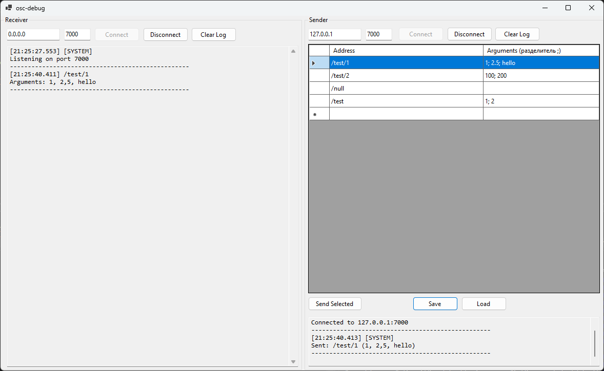

# osc-debug

 <!-- Add actual screenshot path if available -->

A powerful Windows Forms application for debugging OSC (Open Sound Control) messages. This tool allows you to receive, send, and log OSC messages with a clean, intuitive interface designed for both developers and audio/visual artists.

## Features

- 📡 **Dual-mode operation**: Separate receive and send functionality
- 🔍 **Detailed logging**: Timestamped messages with address and arguments
- 💾 **Command management**: Save and load OSC commands to/from CSV files

## Requirements

- [.NET 9](https://dotnet.microsoft.com/download/dotnet/9.0) (Runtime or SDK)
- Windows 10/11 (64-bit)
- Visual Studio 2022 (for development)

## Installation

### Option 1: Pre-built Executable (Recommended for Users)

1. Download the latest release from the [Releases page](https://github.com/RottenEagle1337/osc-debug/releases)
2. Extract the ZIP archive to your preferred location
3. Run `osc-debug.exe` to start the application

### Option 2: Build from Source

## Usage

### Receiving OSC Messages

1. In the **Receiver** section:
   - Set the listening port (default: 7000)
   - Click **Connect** to start listening
   - Received messages appear in the log with timestamp, address, and arguments
   - Use **Clear Log** to reset the message history
   - Click **Disconnect** when finished

### Sending OSC Messages

1. In the **Sender** section:
   - Configure target IP address and port
   - Click **Connect** to establish connection
   - Add OSC commands to the table:
     - **Address**: Path like `/test/command`
     - **Arguments**: Values separated by semicolons (`1; 2.5; hello`)
   - Select rows and click **Send Selected** to transmit messages
   - View transmission history in the send log section
   - Use **Save**/**Load** to persist your command sets

### Managing Command Sets

- **Save commands**: Click **Save** to export current table to CSV
- **Load commands**: Click **Load** to import previously saved commands
- CSV format: `address;arguments` (one command per line)

## Dependencies

This project uses the following NuGet packages:
- [Rug.Osc](https://www.nuget.org/packages/Rug.Osc/) - OSC protocol implementation
- .NET Windows Forms SDK

## License

This project is licensed under the MIT License - see the [LICENSE](LICENSE) file for details.

 

*Developed with ❤️ for the OSC community*